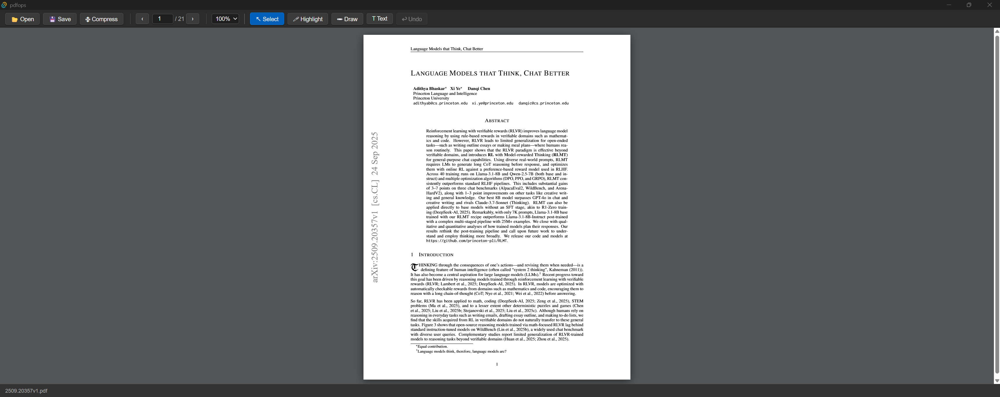
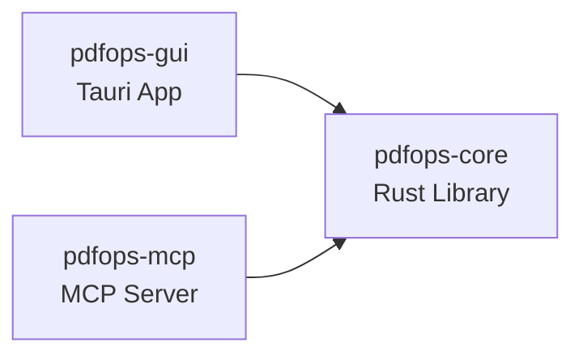

# LightPDF

A fast, lightweight PDF toolkit built with **Tauri v2 + React + Rust**.  
Ships as two products from a single monorepo:

| Product | Description |
|---------|-------------|
| **`pdfops-gui`** | Cross-platform desktop app — view, annotate and compress PDFs |
| **`pdfops-mcp`** | MCP server — expose PDF operations to AI assistants (Claude Desktop, etc.) |



---

## Features

### Desktop App (`pdfops-gui`)
- 📄 **PDF Viewer** — PDF.js rendering with HiDPI / Retina support (no blur at 100%)
- 🔍 **Smooth zoom** — toolbar dropdown (25 %–400 %) or **Ctrl + scroll wheel**
- 📖 **Keyboard navigation** — `PageUp` / `PageDown` / `←` / `→`
- 🖊 **Highlight annotations** — drag to draw yellow highlight rectangles
- ✏️ **Freehand draw** — ink annotations baked into PDF on save
- **T Text annotations** — click to place floating text labels
- ↩ **Undo** — one-click removal of the last annotation
- 🗜 **Compress** — zlib content-stream compression via lopdf
- 💾 **Save with annotations** — writes standard PDF annotation objects (Highlight / Ink / FreeText) readable by any PDF viewer
- 📂 **Drag & drop** — drop a PDF onto the window to open it

### MCP Server (`pdfops-mcp`)
- `compress_pdf` — compress a PDF and return size statistics
- `get_pdf_info` — return page count, title, file size
- `markdown_to_pdf` — convert Markdown (with LaTeX math) to Typst source / PDF
- `merge_pdfs` — merge multiple PDFs into one

---

## Quick Start

### Prerequisites

| Tool | Version |
|------|---------|
| Rust + Cargo | ≥ 1.78 |
| Node.js | ≥ 20 |
| Tauri CLI | v2 (`cargo install tauri-cli`) |

### Run in development
```bash
git clone https://github.com/lichman0405/lightpdf.git
cd lightpdf/pdfops-gui
npm install
npm run tauri dev
```

### Build for production
```bash
npm run tauri build
# Installer appears in src-tauri/target/release/bundle/
```

### Run the MCP server
```bash
cargo run -p pdfops-mcp
# Listens on stdio — configure in your AI client (see docs)
```

---

## Monorepo Structure

```
lightpdf/
├── pdfops-core/        # Pure Rust library (compress, md→typst)
├── pdfops-gui/         # Tauri v2 desktop app
│   ├── src/            #   React 19 + TypeScript frontend
│   └── src-tauri/      #   Rust backend (Tauri commands)
└── pdfops-mcp/         # MCP protocol server (stdio)
```



---

## Keyboard Shortcuts

| Key | Action |
|-----|--------|
| `PageDown` / `→` | Next page |
| `PageUp` / `←` | Previous page |
| `Ctrl + Scroll` | Zoom in / out |

---

## MCP Server Configuration (Claude Desktop)

Add to `~/Library/Application Support/Claude/claude_desktop_config.json` (macOS)  
or `%APPDATA%\Claude\claude_desktop_config.json` (Windows):

```json
{
  "mcpServers": {
    "lightpdf": {
      "command": "/path/to/pdfops-mcp"
    }
  }
}
```

---

## Documentation

Full documentation: **[lichman0405.github.io/lightpdf](https://lichman0405.github.io/lightpdf)**

---

## License

[MIT](LICENSE) © 2026 lichman0405
